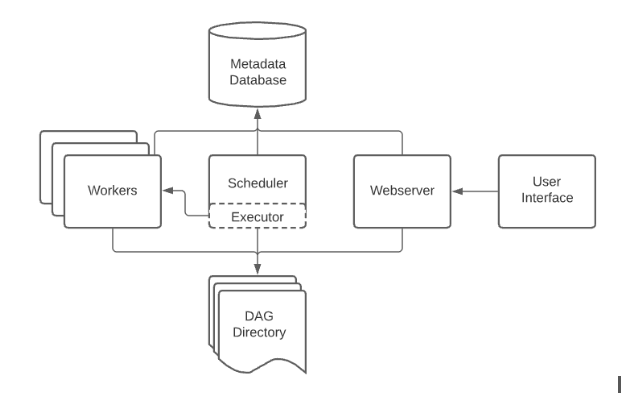

Apache Airflow is an open-source platform used for orchestrating complex workflows and data pipelines. It allows you to programmatically author, schedule, and monitor workflows. Airflow was originally developed by Airbnb and later open-sourced under the Apache Software Foundation.

Airflow is consist of following components:

Each components in detail:
- **Airflow Scheduler:** It takes care of both triggering workflows at the scheduled time and submitting tasks to the Executor. The Scheduler orchestrates all of them.
- **Executor:** It is an internal component of the Scheduler. It takes care of the running tasks. This runs everything inside the Scheduler; it works closely with the Scheduler to figure out what resources will complete those tasks as they’re queued (It is an Intermediate between the Scheduler and the worker).
- **Airflow Web Server:** The Airflow UI inspects the behaviour of DAGs and task dependencies.
- **Metadata Storage Databases:** It keeps records of all the tasks within a directed acyclic graph and their statuses (queued, scheduled, running, success, failed, etc.) behind the scenes.
- **The Airflow Workers:** These are the processes that execute the tasks and are determined by the Executor being used. The workers are responsible for actually ‘doing the task (the work).’

Basic Installation:
