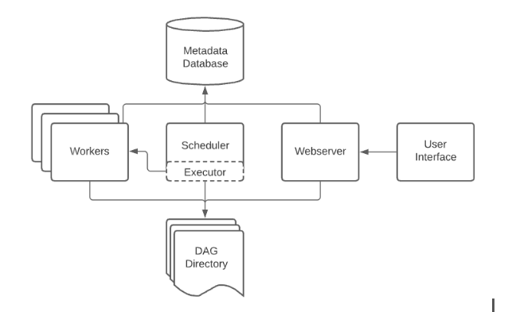

Apache Airflow is an open-source platform used for orchestrating complex workflows and data pipelines. It allows you to programmatically author, schedule, and monitor workflows. Airflow was originally developed by Airbnb and later open-sourced under the Apache Software Foundation.

Airflow is consist of following components:


Each components in detail:
- **Airflow Scheduler:** It takes care of both triggering workflows at the scheduled time and submitting tasks to the Executor. The Scheduler orchestrates all of them.
- **Executor:** It is an internal component of the Scheduler. It takes care of the running tasks. This runs everything inside the Scheduler; it works closely with the Scheduler to figure out what resources will complete those tasks as they’re queued (It is an Intermediate between the Scheduler and the worker).
- **Airflow Web Server:** The Airflow UI inspects the behaviour of DAGs and task dependencies.
- **Metadata Storage Databases:** It keeps records of all the tasks within a directed acyclic graph and their statuses (queued, scheduled, running, success, failed, etc.) behind the scenes.
- **The Airflow Workers:** These are the processes that execute the tasks and are determined by the Executor being used. The workers are responsible for actually ‘doing the task (the work).’

Basic Installation:


Workloads
A DAG runs through a series of Tasks, and there are three common types of task you will see:

- Operators, predefined tasks that you can string together quickly to build most parts of your DAGs.
- Sensors, a special subclass of Operators which are entirely about waiting for an external event to happen.
- A TaskFlow-decorated @task, which is a custom Python function packaged up as a Task.

Internally, these are all actually subclasses of Airflow’s BaseOperator, and the concepts of Task and Operator are somewhat interchangeable, but it’s useful to think of them as separate concepts - essentially, Operators and Sensors are templates, and when you call one in a DAG file, you’re making a Task.


Control Flow
DAGs are designed to be run many times, and multiple runs of them can happen in parallel. DAGs are parameterized, always including an interval they are “running for” (the data interval), but with other optional parameters as well.

```
first_task >> [second_task, third_task]
fourth_task << third_task
```

Or, with the set_upstream and set_downstream methods:
```
first_task.set_downstream([second_task, third_task])
fourth_task.set_upstream(third_task)

```