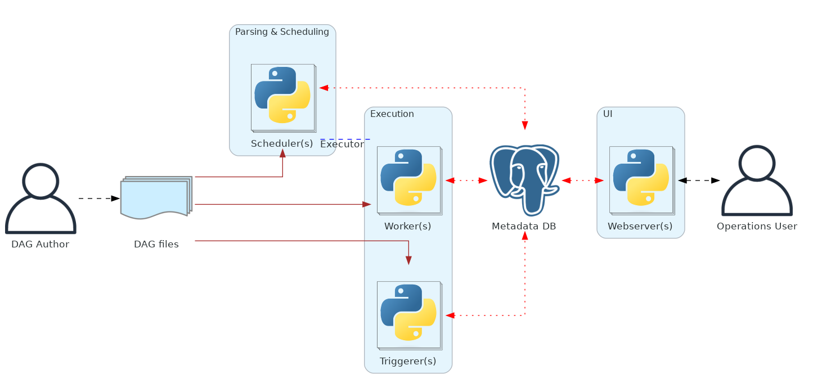

Apache Airflow is an open-source platform used for orchestrating complex workflows and data pipelines. It allows you to programmatically author, schedule, and monitor workflows. Airflow was originally developed by Airbnb and later open-sourced under the Apache Software Foundation.

