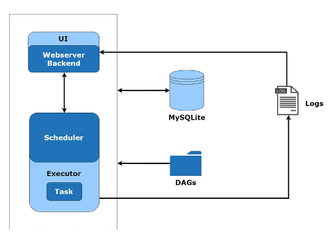

What are various executors in Airflow? 
Which Executor did you use in your Airflow Setup?

- **Sequential Executor:** 
It is a lightweight local executor, which is available by default in airflow. It runs only one task instance at a time
and is **not production-ready**. It can run with SQLite since SQLite does not support multiple connections. It is prone 
- to single-point failure, and we can utilise it for debugging purposes.

- **Local Executor**
Unlike the sequential executor, the local executor can run multiple task instances. Generally, we use MySQL or PostgreSQL 
databases with the local executor since they allow multiple connections, which helps us achieve parallelism. 
You can refer to airflow documentation on LocalExecutor to achieve the best equivalence in your pipeline designs.

- **Celery Executor**
Celery is a task queue, which helps in distributing tasks across multiple celery workers. The Celery Executor distributes 
the workload from the main application onto multiple celery workers with the help of a message broker such as RabbitMQ or Redis. 
The executor publishes a request to execute a task in the queue, and one of several worker nodes picks up the request 
and runs as per the directions provided.

- **Kubernetes Executor**
The Kubernetes Executor uses the Kubernetes API for resource optimization. It runs as a fixed-single Pod in the scheduler 
that only requires access to the Kubernetes API. A Pod is the smallest deployable object in Kubernetes.
When a DAG submits a task, the Kubernetes Executor requests a worker pod. The worker pod is called from the Kubernetes API, 
which runs the job, reports the result, and terminates once the job gets finished.

MySQL or PostgreSQL database systems are required to set up the Kubernetes Executor. It does not require additional 
components such as a message broker like Celery but a Kubernetes environment.
One of the advantages of Kubernetes Executors over the other executors is that Pods only run when tasks are required to 
be executed, which helps to save resources when there are no jobs to run. In other executors, the workers are statically 
configured and are running all the time, regardless of workloads.
It can automatically scale up to meet the workload requirements, scale down to zero (if no DAGs or tasks are running), 
and is fault-tolerant.

- **CeleryKubernetes Executor**
It permits users to run Celery Executor and a Kubernetes Executor simultaneously. The CeleryKubernetes Executor documentation mentions a thumb rule on when to use this executor:
If the scheduling of tasks exceeds the available resources and threshold, the Kubernetes cluster will handle the situation comfortably.
A relatively small portion of your tasks requires runtime isolation.
If you have plenty of small tasks that Celery workers can manage but also have resource-hungry jobs that will be better to run in predefined environments.

