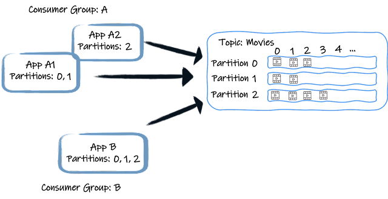

## Where is the offset of consumer stored in kafka?

In Apache Kafka, the offset of a consumer is stored in a Kafka topic called the "__consumer_offsets" topic. This topic is 
managed and maintained by Kafka to keep track of the consumption progress (offsets) for each consumer group.





Here's how it works:

### Topic Creation:

When a consumer group is created or when a consumer from a group starts consuming from a topic, Kafka automatically creates the "__consumer_offsets" topic if it doesn't exist.
Partitioning:

The "__consumer_offsets" topic typically has multiple partitions, and each partition corresponds to a specific consumer group. Partitions help distribute the load and provide parallelism.
Record Format:

Each record in the "__consumer_offsets" topic represents a committed offset for a particular consumer group and partition. It contains information such as the consumer group, partition, and committed offset.
Consumer Commitment:

As consumers process messages from Kafka partitions, they periodically commit their offsets to the "__consumer_offsets" topic. This commitment indicates the last processed message's offset for each partition.
Fault Tolerance:

Kafka replicates the "__consumer_offsets" topic to ensure fault tolerance. This means that if a Kafka broker or partition fails, the offset information is not lost.
Retention Period:

The offset records in the "__consumer_offsets" topic have a retention period, meaning that after a certain period, old offset records are removed. The retention period is configurable in Kafka.
Consumer Resuming:

When a consumer from a group restarts or a new consumer joins a group, it retrieves its last committed offset from the "__consumer_offsets" topic. This allows the consumer to resume processing from where it left off.
Offset Commit Strategies:

Kafka allows consumers to choose between automatic and manual offset committing. In automatic mode, Kafka commits offsets automatically at regular intervals. In manual mode, the consumer has more control over when offsets are committed.
By storing consumer offsets in a dedicated Kafka topic, Kafka provides a centralized and durable mechanism for managing and coordinating the consumption progress of consumer groups. This design ensures that consumers can recover their state, even in the presence of failures or restarts.


Each consumer group receives each record from a topic once. To achieve this, it assigns each consumer from a group to a set of partitions. For example, in the above picture, the consumer from the application A1 receives the records from the partitions 0 and 1. A2 receives the records from the partition 2. App B is the only consumer from its consumer group. So, it gets the records from all three partitions. Consequently (ignore rebalance or other subtilities for now), each record from a topic is only received once per consumer group, by a specific consumer from that group.

To orchestrate each consumer group’s progress, each consumer periodically informs the broker of its current position - the last processed offset. It commits the offset, indicating that all the previous records from that partition have been processed. So, if a consumer stops and comes back later, it restarts from the last committed position (if assigned to that partition again). Note that this behavior is configurable.

What’s important to notice is the periodic aspect of the commit. Offset commit is expensive, and to enhance performance, we should not commit the offset after each processed record. In this regard, Kafka behaves differently from traditional messaging solutions, such as JMS, which acknowledges each message individually. Another important characteristic is the positional aspect of the commit. You commit the position indicating that all the records located before that position are processed. But is it really the case?

The Kafka default behavior
The Apache Kafka consumer uses an auto-commit approach by default. Applications using such a consumer are structured around a polling loop:


```
while(true) {
    ConsumerRecords records = consumer.poll(Duration.ofMillis(10000));
    processRetrievedRecords(records);
}
```
Such a program polls a batch of records, processes them, and then polls the next set. While calling the poll method, the consumer periodically commits the last offset of the previous batches transparently.

Quite nice, right? If the application fails to process a message, it throws an exception, which either interrupts the while loop or is handled gracefully (within the processRetrievedRecords method). In the first case, it means that it won’t commit anymore (as it happens in the poll method, not called anymore). If the application restarts, it resumes from the last committed offset (or apply the auto.offset.reset strategy, defaulting to latest, if there are no offsets for this group yet). It may re-process a set of messages (it’s the application’s responsibility to handle duplicates), but at least nothing is lost.

So, is there anything wrong with this? Looks wonderful…​ until you add a pinch of asynchrony.

https://quarkus.io/blog/kafka-commit-strategies/