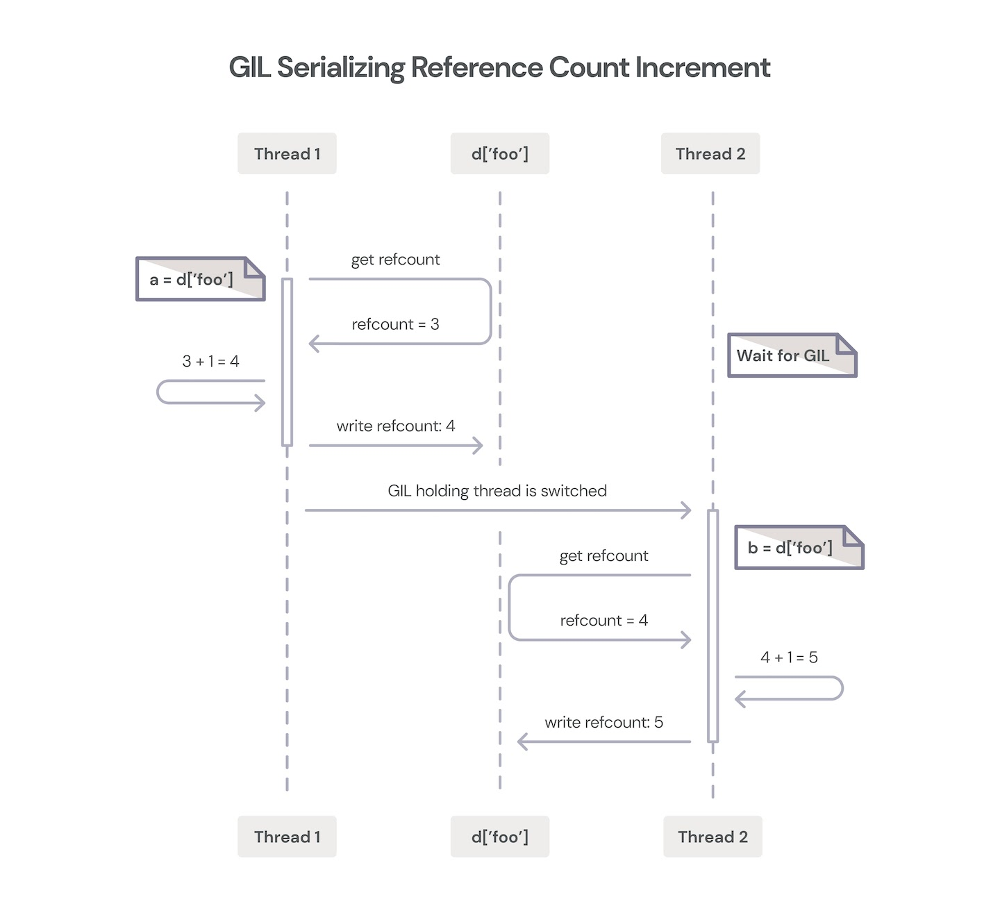
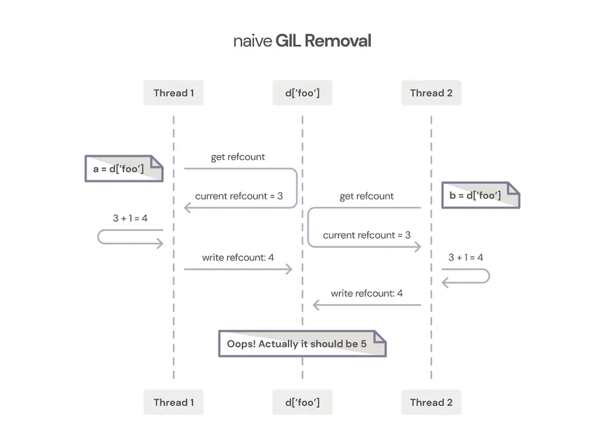

## The Global Interpreter Lock (GIL)

The Global Interpreter Lock (GIL) is a mechanism used in CPython, which is default and most widely used implementation
of Python, to synchronize access to Python objects, preventing multiple native threads from executing Python bytecodes at once.

 It's important to note that the GIL is specific to CPython and does not apply to other implementations of Python, 
 such as Jython or IronPython.
 

Key points about the Global Interpreter Lock (GIL):

Concurrency Limitation:

The GIL allows only one thread to execute Python bytecode at a time in a single process. This means that multiple native threads can't execute Python code in parallel within the same process.
Impact on CPU-Bound Tasks:

The GIL can have a significant impact on the performance of CPU-bound tasks, as it limits the effectiveness of parallel execution on multiple cores. Threads in a multi-threaded Python program may not fully utilize multiple CPU cores for CPU-bound operations.
I/O-Bound Tasks:

For I/O-bound tasks, where the program spends a considerable amount of time waiting for external resources (e.g., network, disk I/O), the GIL is less of a hindrance. In such scenarios, multiple threads can still make progress concurrently.
No Impact on Multiprocessing:

The GIL only affects threads within the same process. Multiple processes running independently can still achieve parallelism using multiprocessing without GIL restrictions.
Use of Multithreading:

While the GIL limits the potential benefits of multithreading for CPU-bound tasks in Python, it can be effective for concurrent execution of threads in scenarios where threads spend a significant amount of time waiting for external resources.
CPython-Specific:

The GIL is specific to CPython and is not a feature of the Python language itself. Other implementations of Python, such as Jython or IronPython, may not have a GIL and can potentially achieve better parallelism with threads.
It's worth noting that the GIL is a trade-off made in CPython for simplicity and ease of integration with C libraries. It simplifies memory management and makes it easier to write C extension modules. However, it introduces challenges when trying to achieve parallelism with multiple threads in CPU-bound scenarios.

Developers often use alternative approaches, such as multiprocessing or utilizing other programming languages for performance-critical tasks, to work around the limitations of the GIL in CPython. Additionally, the introduction of asynchronous programming with asyncio provides an alternative concurrency model that can be effective for certain scenarios without the need for multiple threads.

